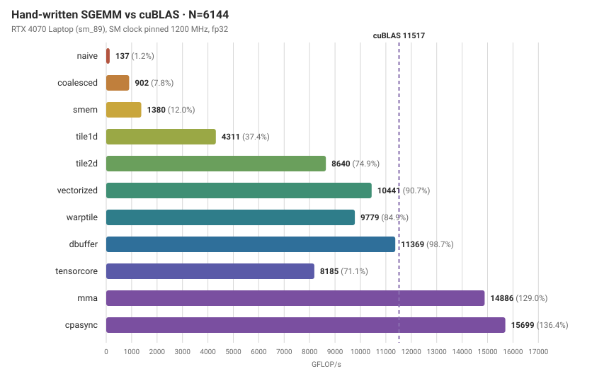
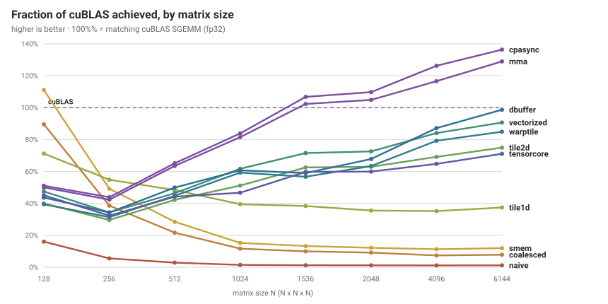
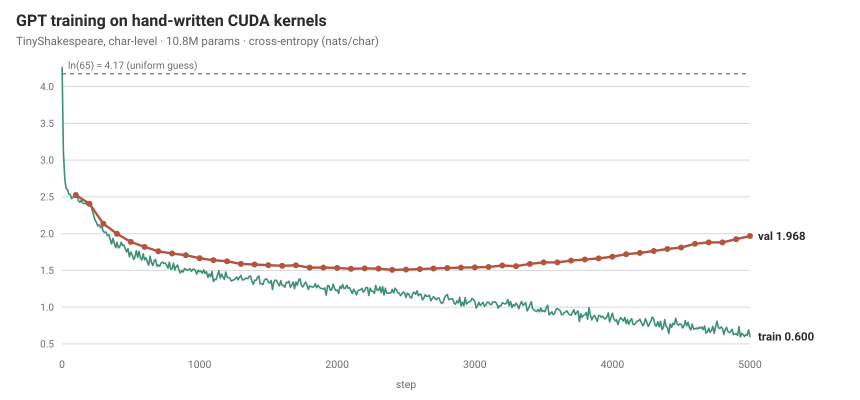

# A CUDA matmul, and a language model built on top of it

A hand-written CUDA SGEMM taken from 1.2% of cuBLAS to **matching it in fp32**
(95%) and **passing it with tensor cores** (130%), then used to train a GPT from
scratch — including a **fused FlashAttention-style kernel** that never
materializes the score matrix, which doubled the context length this 8 GB card
can train. No PyTorch, no cuBLAS, no cuDNN in the training path —
every matmul, layernorm, softmax, attention, GELU, cross-entropy and AdamW
kernel here is written from scratch.

**Hardware:** RTX 4070 Laptop (Ada, sm_89) — 36 SMs, 256 GB/s, 8 GB, 55 W.
Everything below the [kernel 11 section](#kernel-11-cpasync-and-the-wrong-reason-for-a-right-answer)
was measured there. The project has since moved to an RTX 5070 Ti Laptop
(Blackwell, sm_120) — 46 SMs, 12 GB, 100 KiB shared/SM — and numbers taken on
that card say so explicitly wherever they appear. The two are **not**
comparable and no table here mixes them.

Builds and runs on anything from **sm_70 upward**. The tensor-core kernels
are TF32, which is Ampere and newer, so below sm_80 they are not compiled in
and every matmul takes the fp32 path — the ladder then runs kernels 1-8 and
`--tf32` is a no-op rather than an error. That matters because the obvious
free hardware for this project is a Colab or Kaggle T4, which is sm_75.

**Writeup:** <https://bare-metal-bard.vercel.app>

---

## Results: the matmul



At N=4096, fp32, SM clock pinned to 1200 MHz, CUDA 13.3. Every cell is the
**median of three independent sweeps** — see *Methodology* for why that is not
paranoia:

| # | kernel | GFLOP/s | % of cuBLAS | what changed |
|---|--------|--------:|------------:|--------------|
| 1 | naive | 82.8 | 1.2% | one thread per output element |
| 2 | coalesced | 647.7 | 9.2% | swapped which index maps to `threadIdx.x` |
| 3 | smem | 814.5 | 11.5% | 32×32 shared-memory tile |
| 4 | tile1d | 2596.7 | 36.7% | 8 outputs per thread |
| 5 | tile2d | 5262.2 | 74.4% | 8×8 register tile (outer product) |
| 6 | vectorized | 6249.9 | 88.3% | `float4` loads + transposed A tile |
| 7 | warptile | 6405.1 | 90.6% | block → warp → thread blocking |
| 8 | dbuffer | **6711.2** | **95.0%** | double-buffered SMEM, one barrier/chunk |
| 9 | tensorcore | 8323.6 | 117.6% | WMMA m16n16k8 TF32 tensor cores |
| 10 | mma | **9215.8** | **130.3%** | raw `mma.sync` PTX, lane-major SMEM, 64×64 warp tile |

**111× from first kernel to last.** Kernel 8 reaches 99.5% of cuBLAS at N=1024,
and both top kernels do better still at sizes that divide the 128×128 block tile
evenly, where no thread block is left partly idle: kernel 8 exceeds cuBLAS at
N=1536 (104.0%) and N=6144 (104.2%), and kernel 9 reaches ~121% at both.

These numbers were re-measured on the machine the GPU actually lives in. An
earlier set, taken on a Linux box with CUDA 12.4, is in the git history, and all
nine kernels reproduce across the two machines to within ~1%. Kernel 10 was
written after that move and exists only on this one.

### The tensor-core number, stated honestly

The baseline above is cuBLAS in **true fp32**, which is what cuBLAS does by
default — TF32 has been opt-in since CUDA 11. Kernel 9 uses tensor cores, so it
is not computing the same thing. Both comparisons, at N=4096:

| | GFLOP/s | vs fp32 cuBLAS | vs TF32 cuBLAS |
|---|--------:|---------------:|---------------:|
| cuBLAS, true fp32 (default) | 7069 | 100% | — |
| cuBLAS, TF32 tensor cores | 10505 | 149% | 100% |
| `dbuffer` (mine, fp32) | 6712 | 95.0% | 63.7% |
| `tensorcore` (mine, WMMA TF32) | 8318 | 117.6% | 79.2% |
| `mma` (mine, raw PTX TF32) | 9210 | 130.2% | 87.7% |

So kernel 10 beats fp32 cuBLAS by 30% and trails cuBLAS's own tensor-core path
by 12%. Quoting only the first would be the flattering half.

TF32 is not free speed: it keeps fp32's 8-bit exponent but only 10 mantissa
bits. Measured normwise error against an fp32 reference goes from **6.2e-08**
for the fp32 kernels to **2.4e-04** — about 4000× more. That is a deliberate
trade, and it is why kernel 9 carries its own tolerance in the registry rather
than loosening the bar for every kernel.

Reproduce the TF32 column with:

```bash
./bench/sgemm --tf32
```



### Kernel 10: the hypothesis was wrong and the kernel got faster anyway

Kernel 9 stopped 21% short of cuBLAS's own TF32 path, and five attempts to
close that from the outside all made it slower — grouped block scheduling, a
256×128 tile, `BK`=16, double buffering, rounding to TF32 at staging time. By
elimination the README blamed the abstraction: WMMA fixes the fragment layout,
so a fragment load is four separate 32-bit shared-memory reads, and raw
`mma.sync` would let me lay shared memory out however the instruction wants it.
That was a specific, falsifiable claim, so kernel 10 tests it.

**Shared memory does not have to hold a matrix.** It only has to hold whatever
makes the next read cheap. The `mma.m16n8k8` TF32 instruction requires each of
the 32 lanes to hold four particular elements of A:

```
g = laneid >> 2,  t = laneid & 3
a0 = (g, t)   a1 = (g+8, t)   a2 = (g, t+4)   a3 = (g+8, t+4)
```

In a row-major tile those four sit at four unrelated addresses. So kernel 10
stores each 16×8 tile **lane-major** instead — lane `L`'s four elements at
`L*4 .. L*4+3` — and the fragment load becomes one `LDS.128` at
`base + laneid*16`, which is also the perfect shared-memory access pattern: 32
lanes covering 512 contiguous bytes, no bank conflict possible.

| per warp, per k-step of 8 | WMMA | kernel 10 |
|---|---:|---:|
| shared load instructions | 24 | **6** |
| bytes read from shared | 3072 | 3072 |
| `mma` issued | 16 | 16 |

Four times fewer instructions to move exactly the same bytes. And that is a
fair test, because it isolates the thing being blamed.

**It bought 2.7%.** At kernel 9's own tile shape, 8540 against 8318 GF/s. The
gap was never the abstraction. Instruction issue on the shared path was not the
constraint, which means the bytes were — and WMMA moves exactly as many.

#### Two things that went wrong on the way, both worth more than the result

**A fragment layout is a fact to measure, not to recall.** I wrote the A
register order from memory and got `a1` and `a2` swapped — that ordering is
correct for the analogous f16 shape, but the TF32 shape concatenates two k4
chunks instead of two row halves. The kernel compiled, ran at full speed, and
returned garbage. Guessing produced a *silent* wrong answer, so
[`scripts/probe.bat`](scripts/probe.bat) now runs a one-hot probe that
discovers the mapping on the hardware: set one element of A to 1, make B the
identity, see which lane and register light up.

**Fewer instructions is worth nothing if the bytes arrive four at a time.** The
first correct version ran 8% *slower* than the WMMA kernel it was meant to
beat — on a layout whose entire justification was cheaper shared access. The
lane-major store pattern is 8-way bank conflicted on A and 16-way on B, because
a warp of staging threads varies only in bits the slot index scales by 4. The
fix is an XOR swizzle: `slot ^= f(unit)`, where `f` depends only on which tile
the element belongs to. Staging sees `f` vary across the warp and spreads out;
a fragment load reads one whole tile per warp, so `f` is uniform there and the
permutation is invisible. 8-way and 16-way become 2-way, and the load stays
perfectly conflict-free.

That is index arithmetic, not a hardware mystery, so it can be settled without
a GPU — [`tools/smem_banks.py`](tools/smem_banks.py) derives both layouts,
proves they are bijections, checks that a fragment load picks up exactly the
elements `mma.m16n8k8` demands in exactly the right register slots, and
simulates the bank pattern of every access:

```
                             no swizzle   swizzled
A staging stores                     8x         2x
B staging stores                    16x         2x
A fragment loads                     1x         1x
B fragment loads                     1x         1x
```

#### The actual win was somewhere else

With the layout fixed, the tile sweep says what the kernel was really limited
by. Let `B/mma` be bytes read from shared memory per `mma` issued — the reuse a
warp gets out of what it loads:

```
bytes/mma = 4096 * (WM + WN) / (WM * WN)
```

At N=4096, clock pinned to 1200 MHz, median of three:

| cfg | threads | WM×WN | B/mma | regs | spill | GF/s | |
|---|---:|---|---:|---:|---:|---:|---|
| 0 | 256 | 32×64 | 192 | 128 | 84 | 8540 | kernel 9's shape |
| **1** | **128** | **64×64** | **128** | **255** | **4** | **9286** | **chosen** |
| 7 | 128 | 32×128 | 160 | 255 | 4 | 9246 | |
| 2 | 128 | 64×64 | 128 | 168 | 484 | 8698 | 3 blocks/SM |
| 3 | 256 | 64×64 | 128 | 254 | 0 | 7838 | BN=256 |
| 6 | 256 | 64×64 | 128 | 255 | 0 | 7832 | BM=256 |
| 4 | 128 | 64×64 | 128 | 128 | 776 | 4433 | BK=16 |

Config 0 → config 1 is the same instruction and the same layout with a warp
tile twice as tall, and it is worth **8.7%** — three times what replacing WMMA
with hand-written PTX was worth. **Shared-memory reuse was the constraint all
along**, and reuse is a register-budget problem in disguise, since `bytes/mma`
falls only when both warp-tile dimensions grow and the accumulator costs
`WM*WN/32` registers per thread.

So why couldn't kernel 9 do this? It tried: 128 threads at 64×64 is in its
tuning table at 7783 GF/s, *slower* than the shape it settled on. WMMA at that
warp tile needs 255 registers and spills; the hand-written version spills four
bytes. **Raw PTX did matter — just indirectly, by making the tile affordable
rather than by making the loads cheaper.** The stated hypothesis was wrong and
the conclusion drawn from it was right, which is not the same thing as being
right, and is why the sweep is in the repo.

Configs 3 and 6 test the other lever — block-tile arithmetic intensity against
DRAM — and lose 16%, exactly as they did on kernel 9. This kernel is not DRAM
bound however much the DRAM counter looks like it.

| | GF/s at N=4096 | vs cuBLAS TF32 |
|---|---:|---:|
| kernel 9, WMMA | 8318 | 79.2% |
| kernel 10, raw `mma.sync`, same tile | 8540 | 81.3% |
| kernel 10, 64×64 warp tile | **9210** | **87.7%** |

Two things did *not* work and are recorded in
[`k10_mma.cu`](src/kernels/k10_mma.cu) so they are not retried. `BK`=64
overflows shared memory at this tile. And rounding to TF32 during staging —
which replaces 96 `cvt` per thread per K-chunk with 32 — costs 4.4%, the same
change that cost kernel 9 4.6% on a completely different loop structure. In the
compute phase the conversions hide behind independent work; in the staging
path, between a global load and a barrier, there is nothing to hide behind.
Counting operations is not the same as counting time.

#### Putting it in the model, where it behaves differently

The ladder kernel only does `NN`. The model needs all four transpose cases, and
the lane-major layout ports cleanly because it is a function of the *logical*
element `(m,k)`, not of how the operand is stored. All four cases share one map.
What changes is only which axis the global `float4` runs along, and therefore
which bits of the destination slot the four staged values step through — 1 for
a read along `k`, 4 for a read along `m` or `n`.

**Result: 67.7 → 65.2 ms/step, 3.7% off the training step**, replicated three
times each way with the SM clock pinned, identical loss to four decimals.

Two things had to be got right first, and neither was visible from the square
benchmark.

**The swizzle has to key on the axis staging walks.** The XOR swizzle must be
uniform across a warp doing a fragment load and varying across a warp doing a
staging store. Only one tile coordinate is both, and it is the one the staging
warp actually walks — which the transpose flag decides:

| | stages along | swizzle keys on |
|---|---|---|
| A, `transA=false` | k | `kt` |
| A, `transA=true` | m | `mi` |
| B, `transB=false` | n | `nj` |
| B, `transB=true` | k | `kt` |

I ported the untransposed key to all four. For the transposed cases that is
warp-uniform during staging, so the swizzle does nothing and the stores go back
to being 16-way conflicted. **This is not a correctness bug**, so every test
passed; it showed up only as the transposed cases running 20% slower than the
WMMA path they were replacing, while the untransposed ones were fine. Geomean
over the model's twenty shape/transpose combinations: **0.887×**. With the key
fixed, **1.044×**.

The pattern in the numbers is what identified it — `NN` and `NT` near parity,
`TN` and `TT` at 0.80–0.84 — because `TA=true` is the half where the key was
wrong. `tools/smem_banks.py` now simulates all four orientations and would have
caught it before the kernel was built.

**The best tile on a square benchmark is not the best tile in the model.** A
64×64 warp tile in 128-thread blocks is worth 8.7% at N=4096 because it halves
shared-memory traffic per `mma`. In situ it *loses*, 1.034× against the
32×64/256 shape's 1.044×. The model's GEMMs are 4096×384×384 and friends, so a
128×128 block tile gives 96 blocks against 36 SMs — the machine is not full,
and a 128-thread block brings half as many warps per SM to hide latency with.
The extra reuse is real and there is nothing to spend it on. So the ladder and
the model deliberately run different tiles, and both numbers are here rather
than only the flattering one.

```bash
python3 tools/smem_banks.py      # layout proofs, no GPU needed
scripts\probe.bat <file.cu>      # discover a fragment layout on the hardware
scripts\sweep_k10.bat 4096       # the tile sweep above
```

### The compiler optimized the thing it could see

Kernel 9 was sitting at 8064 GF/s until a question about a version number: the
writeup said CUDA 12.5, but 13.3 was also installed. Building the same source
with both, same machine, same pinned clock, N=4096:

| kernel | CUDA 12.5 | CUDA 13.3 | |
|---|--------:|--------:|---|
| naive … dbuffer | — | — | agree within 1% |
| tensorcore | **8064** | **6499** | **−19.4%** |

Eight of the nine kernels that existed then are indistinguishable. The
tensor-core kernel loses a
fifth of its throughput — three runs each, 8049/8051/8064 against
6511/6505/6496 — at *identical* numerical error, so it is still genuinely TF32,
just slower. `ptxas -v` gives the whole story in two lines:

```
12.5:  128 registers, 12 bytes spill stores
13.3:  142 registers,  0 spills
```

nvcc 13.3 spent 14 more registers to eliminate a 12-byte spill. That is a good
trade in isolation and a bad one here, because at 256 threads per block it
crosses an occupancy cliff. Registers are allocated per warp in multiples of 8:

- 128 regs → 4096/warp → 65536/4096 = **16 warps/SM** → 2 resident blocks
- 142 regs → rounds to 144 → 4608/warp → 65536/4608 = **14 warps/SM** → 1 block

Halving resident blocks to avoid twelve bytes of spill. The compiler optimized
what it could see — the spill — and could not see what it cost.

The fix is to say what the kernel needs, rather than hoping the register
allocator infers it:

```cuda
__global__ __launch_bounds__(NUM_THREADS, 2) void tensorcore_kernel(...)
```

The second argument is minimum blocks per SM. Both toolkits then allocate 128
registers and accept the spill, and this is *not* a 13.3 workaround — it is
faster on both:

| | before | after |
|---|--------:|--------:|
| CUDA 12.5 | 8064 (113.9%) | **8250 (116.7%)** |
| CUDA 13.3 | 6499 (91.6%) | **8290 (117.3%)** |

A spilled byte is cheap; a resident block is not. `__launch_bounds__` is how you
tell the compiler which one you are buying.

With the fix in place the two toolkits agree across the board, so the repo
builds with **whichever is newest** and prints which one it used;
`scripts\build.bat --cuda 12.5` pins the older one. Everything published here is
now measured on 13.3.

The lasting lesson is not that one compiler release regressed. It is that a 19%
loss passed every correctness test, every gradient check and every loss curve
without a murmur, and surfaced only because someone asked why a page said 12.5.
Performance regressions are invisible to correctness testing by construction —
the only thing that catches them is measuring on purpose, which is what the
benchmark harness in this repo is for.

### The one measurement that mattered

The single most useful number in the project came from the profiler, not from
reading. After kernel 6 I was at 88% and had no idea what was left. `ncu` said:

```
DRAM Throughput          15.1%     <- global memory is not the problem
L1/TEX Cache Throughput  81.4%     <- saturated
Compute (SM) Throughput  54.2%
```

Shared memory and L1 share the same LSU/MIO datapath. 81% L1 with 15% DRAM means
the kernel was bound on **shared-memory→register traffic** — the FMA units were
idle waiting for operands to arrive from SMEM, and no amount of further work on
global memory access would have helped.

Warp tiling cuts SMEM loads per FMA from 0.25 to 0.1875 by adding a blocking
level between the block and the thread. Measured after:

```
L1/TEX Cache Throughput  81.4%  ->  50.0%
```

The kernel is now **latency bound**: neither memory (45%) nor compute (55%) is
saturated, at ~25% occupancy — which is what kernel 8 goes after. The cause was
structural rather than in any counter: the global load was immediately followed
by a barrier, so the ~500-cycle DRAM round trip never overlapped anything.
Double buffering keeps two tiles resident so the next chunk's loads fly while
the current one computes, and cuts barriers from two per K-chunk to one.

Warp cycles per issued instruction across the three: **5.75 → 3.08 → 2.85**.

### Why the ridge point explains the whole sequence

The roofline ridge point for this card at 1200 MHz is **43 FLOP/byte** — every
byte read from HBM must feed 43 flops to reach peak. Arithmetic intensity per
kernel:

| kernel | FLOP/byte | bound by |
|---|---:|---|
| naive | 0.25 | DRAM, by ~170× |
| smem | 8 | DRAM |
| tile1d | 16 | DRAM |
| tile2d / vectorized | 32 | approaching compute |
| warptile | 32 (+ less SMEM traffic) | latency |
| dbuffer | 32 (latency overlapped) | compute / issue |
| tensorcore | 64 (BK=32) | tensor core issue rate |

Every optimization in the list is the same move applied at a different level of
the hierarchy: *load a value once, then spend it on as much arithmetic as
possible before letting it go.*

---

## Kernel 11: `cp.async`, and the wrong reason for a right answer

**Everything in this section was measured on the RTX 5070 Ti Laptop (Blackwell,
sm_120), not the 4070 the table above uses.** The two cards share no numbers.
Kernel 10 was re-measured on the new card in the same process, in the same
sweeps, so the comparison below is internally valid even though it cannot be
placed next to anything higher up the page.

Kernel 10 stages through registers: 16 `LDG.128` into registers, then 64
`STS.32` to scatter them into the lane-major layout, then a barrier, then the
arithmetic. `cp.async` moves global→shared without the value entering a register
file, and it is asynchronous. The [next-steps list](#what-id-do-next) called
this "the main event" on the grounds that kernel 10 is register-bound at 255
with a spill, so the ~64 registers the staging pins are taken out of the same
budget as the warp tile that produced most of its speedup.

First, a constraint that turned out to be structural rather than an
implementation detail. `cp.async` copies a **contiguous** 4, 8 or 16 bytes of
global to a **contiguous** 4, 8 or 16 bytes of shared. The lane-major layout
exists precisely so that one lane's four `mma` operands are contiguous in
shared — and those four operands are `A[g][t]`, `A[g+8][t]`, `A[g][t+4]`,
`A[g+8][t+4]`, four unrelated addresses in a row-major A. So no 16-byte global
chunk maps to a 16-byte shared chunk, ever, and no rearrangement of the tile
fixes it, because the fragment mapping and the contiguity requirement are both
fixed by hardware. That leaves 4-byte `cp.async`: 64 instructions per thread per
chunk against kernel 10's 16 + 64, and zero staging registers.

Median of three sweeps, clock pinned to 1200 MHz, CUDA 13.3
([`bench/results_sm120.csv`](bench/results_sm120.csv), worst spread 0.9%):

| N | kernel 10 | kernel 11 | |
|---|---:|---:|---:|
| 2048 | 10077 | **10627** | +5.5% |
| 4096 | 11100 | **11994** | +8.1% |

Same arithmetic — same `mma` sequence in the same k order, only the staging
moved — and the error against the fp32 reference is identical to two figures
for both kernels.

### The stated reason was worth a quarter of the answer

The configuration sweep separates the two claims, because one entry runs
`cp.async` with **no pipeline at all** — the same schedule kernel 10 runs, with
the staging replaced. One sweep at N=4096, enough to rank configurations 18%
apart:

| cfg | BK | stages | shared | blocks/SM | GF/s |
|---|---:|---:|---:|---:|---:|
| — | 32 | *(k10)* | 32 KB | 2 | 11100 |
| 0 | 32 | 1 | 32 KB | 2 | 11329 |
| 1 | 16 | 2 | 32 KB | 2 | 11667 |
| **2** | **16** | **3** | **48 KB** | **2** | **11911** |
| 7 | 16 | 3 | 48 KB | 2 | 11875 |
| 6 | 8 | 4 | 32 KB | 2 | 10736 |
| 3 | 16 | 4 | 64 KB | 1 | 8910 |
| 4 | 32 | 2 | 64 KB | 1 | 9156 |
| 5 | 32 | 3 | 96 KB | 1 | 9152 |

Config 0 is the register argument on its own, and it is worth **2.1%**. The
overlap takes it the rest of the way. So the reason this kernel was written —
freeing the staging registers — accounts for about a quarter of what it
delivered, and the asynchrony, which the next-steps note treated as a bonus,
was the point. The prediction was right about the outcome and wrong about the
mechanism, which is the third time in this project that has happened (see
[kernel 10](#kernel-10-the-hypothesis-was-wrong-and-the-kernel-got-faster-anyway)).

### The cliff is sharper than anything else in this repo

Every configuration at 32 or 48 KB beats kernel 10. Every configuration at
64 KB or more loses to it by 18% — and they all land on the *same* number
(8910, 9156, 9152) regardless of `BK` or pipeline depth. That is not a tuning
curve, it is a step. `bench/device_query` reports **100 KiB of shared memory per
SM**, so two 48 KB blocks fit and two 64 KB blocks cannot, and a 128-thread
block alone on an SM is four warps with nothing to switch to.

The deepest pipeline measured — config 3, four stages — is the **worst** entry
in the table. Depth is worth having and never worth the second block, so the
axis to tune is not stages but `STAGES * (BM*BK + BK*BN) * 4`, which has to stay
under half the SM's supply. Every stage past the first comes out of `BK`.

This is the same shape as the occupancy cliff kernel 9 hit, arrived at from the
opposite direction: there, a change that improved a profiler counter cost the
second resident block and lost; here, three changes that all improve the
pipeline cost the second resident block and lose by the same 18% each. A
profile says which resource is saturated. It does not say which change is
affordable.

### It does not transfer to the model, and that is the useful part

GEMM is ~80% of a training step, so 8% of GEMM predicts ~6% of training time.
The prediction was worth exactly what predictions here are usually worth: the
same change applied to `src/gemm.cu` — same layout, same swizzle keys, all four
transpose cases, `BK` cut 32 → 16 to pay for the stages — is **slower at every
shape the model runs**, and 46.1 → 47.4 ms/step end to end.

| shape (NN) | | register-staged | `cp.async` | |
|---|---|---:|---:|---:|
| 4096×1536×384 | mlp up | 10469 | 9818 | −6.2% |
| 4096×1152×384 | qkv proj | 9937 | 9246 | −7.0% |
| 4096×384×384 | attn proj | 7276 | 6823 | −6.2% |
| 4096×384×1536 | mlp down | 7898 | 7480 | −5.3% |
| 1536×384×4096 | dW fcproj | 8827 | 8481 | −3.9% |
| 384×384×4096 | dW attnproj | 7825 | 7545 | −3.6% |
| 384×1536×4096 | dW fc | 8804 | 8531 | −3.1% |
| 384×1152×4096 | dW qkv | 8473 | 8292 | −2.1% |

The fp32 path is untouched by the change and reads the same in both builds to
within noise, which is what makes this a measurement rather than a drifting
machine.

The obvious suspect is the footprint — three stages at `BK=16` is 48 KB against
32 KB — but it is wrong: **two** stages at `BK=16` is 32 KB, byte for byte what
the kernel already uses, and loses by the same 6%. So the cost is `BK` itself,
not the pipeline it was buying.

What separates the two kernels is reuse per barrier. Kernel 11 runs a 64×64
warp tile — 128 bytes of shared traffic per `mma` — and at `BK=16` still has two
k-steps of independent arithmetic to hide a barrier behind. The model's GEMM
runs 32×64, which is 192 bytes per `mma`, a tile chosen back when the fused
epilogue and the four transpose cases mattered more than the tile did. Halving
`BK` there doubles the barrier count against arithmetic that was already
thinner. A pipeline cannot pay for itself out of a k-chunk that has too little
work in it.

So the change is reverted, the numbers above are recorded in
[`src/gemm.cu`](src/gemm.cu) so it is not retried on the same reasoning, and
the next thing to try in the model is **the warp tile rather than the staging**.
This is the third time a GEMM gain that was real at square sizes has been eaten
by the shapes the model actually runs.

---

## Results: the language model

A 10.8M-parameter GPT (6 layers, 6 heads, 384 embd, 256 ctx, weight-tied head)
trained on TinyShakespeare at character level, entirely on the kernels in this
repo.

```
params    10.80M (41.2 MB; +41.2 MB grads, +82.4 MB adam state)
memory    665.0 MB forward activations, 98.1 MB backward scratch
batch     16 x 256 = 4096 tokens/step
speed     75.1 ms/step, 54,516 tokens/s, ~3917 GFLOP/s end to end
          (67.6 ms and 60,568 tok/s with --tf32; see below)
loss      4.174 (= ln 65, uniform guess) -> 1.5138 val at step 2400
```



Validation bottoms at **1.5138** around step 2400 and then climbs -- 10.8M
parameters on 1 MB of text overfits well before the LR schedule ends, so the
best-validation checkpoint is the one kept, not the last. Full curve, config and
sample: [`docs/training.md`](docs/training.md).

Sampled from that checkpoint at temperature 0.8:

```
Is carried an old for Sirrah Paris' in Edward's blood,
When I, that remember'd up my soul,
With manner which we say twelve pass into the king,
Off his limbs and unto the wars' garden,
To steal the first alone, in this word,
Such a thought broughts dead, and thou like a doit
To unsistake the tongue of the higher.
```

This run uses the [fused attention](#fused-attention-the-score-matrix-never-exists)
described below. Running the same seed and configuration on the unfused path is
the control:

| | step | tokens/s | best val | at step | final train |
|---|---:|---:|---:|---:|---:|
| fused | **86.2 ms** | **47,531** | **1.5035** | 2400 | 0.6463 |
| unfused | 91.9 ms | 44,574 | 1.5147 | 2400 | 0.6493 |

Both bottom out at step 2400 and land 0.011 nats apart, which is what the
identical-computation claim should look like in practice rather than in theory:
fp32 addition is not associative, so a different summation order gives a
trajectory that differs in the last digits and then diverges chaotically over
5000 steps. What matters is that neither the shape of the curve nor the quality
of the model moved. The fused kernels are faster and smaller, not different.

The end-to-end 3917 GFLOP/s sits below the standalone GEMM peak because a
training step is not all GEMM. Profiling every kernel launch with `ncu` and
aggregating by category — this is the **unfused** path, and it is the
measurement that motivated the fused attention below:

| category | share of kernel time |
|---|---:|
| GEMM (matmul) | 65.8% |
| GEMM (attention, batched) | 14.5% |
| bias add / column reduce | 5.7% |
| attention softmax | 3.5% |
| attention permute | 3.1% |
| GELU | 2.9% |
| residual add | 2.3% |
| layernorm | 2.0% |
| cross-entropy, embeddings, optimizer | 0.2% |
| **all GEMM** | **80.3%** |
| **everything else** | **19.7%** |

(Relative shares. The profiled run includes evaluation forward passes and
`ncu`'s replay inflates absolute times, so only the ratios are meaningful.
Eval passes are forward-only and forward is less GEMM-heavy than backward, so
the true share for a pure training step is if anything slightly higher.)

Two things follow. First, ~20% of the time goes to kernels with arithmetic
intensity below 1 — pure bandwidth work that no amount of matmul tuning
touches; the attention score matrices alone move 25 MB per layer per pass, which
is what a fused FlashAttention-style kernel would eliminate. That became
[the next piece of work](#fused-attention-the-score-matrix-never-exists), and
the three attention rows in this table (14.5 + 3.5 + 3.1 = 21.1%) are what it
went after. Second, even the
80% does not run at the headline number: training's matmuls are far skinnier
than the square N=4096 benchmark (K=384 for the attention projections), and
small K leaves less work to amortize each tile load against.

That last point deserved measuring rather than asserting, so `./bench/sgemm`
now takes `--mnk M,N,K`. At the four shapes the model actually runs, with the
clock pinned:

| shape (M×N×K) | what it is | k7 *(in use)* | k8 | k9 (TF32) |
|---|---|---:|---:|---:|
| 4096×1152×384 | qkv projection | 6112 | 6517 | **7482** |
| 4096×384×384 | attention out | 4068 | 4353 | **6176** |
| 4096×1536×384 | MLP up | 5651 | 6026 | **7396** |
| 4096×384×1536 | MLP down | 4377 | 4658 | **6929** |

Two things fall out, and both are free performance the model is not taking.
**The model's GEMM is built on kernel 7, and kernel 8 beats it at every one of
these shapes** by 5–8% — the double buffering that was worth 6% on square
matrices is worth as much or more here. And **the tensor-core kernel is
1.22–1.58× faster than kernel 7** at these shapes, a wider margin than the 1.30×
it manages at square N=4096, because skinny matmuls punish the fp32 kernel more
than they punish the tensor cores.

Since GEMM is ~80% of a step, the second is worth something like 20% of
end-to-end training time, and TF32 is the precision the hardware was built to
train in. Both were done, and together they took **85.0 ms/step to 67.6 ms**.

Double buffering the model GEMM was the easy half: same tile parameters as
kernel 8, arithmetic untouched (loss and gradient norm identical to every
printed digit), 11.4% off the step.

The tensor cores took two attempts, and the second is the instructive one.
Standalone they are 1.22–1.58x faster at these shapes; wired into training the
first version was **2.4% slower**. Timing the same entry point per transpose
case (`./bench/test_gemm --bench`) said why, and the split was perfectly clean:

| case | first version |
|---|---|
| NN, NT (A not transposed) | 1.10–1.47x — tensor cores win |
| TN, TT (A transposed) | 0.64–0.87x — tensor cores lose |

WMMA wants A stored m-major, so `As[m][k]` forces the transposed case to
scatter four scalars per `float4` read, where the fp32 kernel stores `As[k][m]`
and gets a straight vector copy. **The backward pass computes every weight
gradient as TN**, so the forward won and the backward handed it straight back.

The fix is to store each operand in whichever orientation makes staging a
vector copy and choose the *fragment layout* to match — `col_major` when the
operand arrived transposed. Same data, same `mma`, no scatter. TN went to
0.96–1.33x, TT to 1.13–1.43x, and end-to-end TF32 went from 2.4% slower to
**9.8% faster**.

### Does TF32 cost the model anything?

Full 5000-step runs, same seed and configuration:

| | step | tokens/s | best val | at step |
|---|---:|---:|---:|---:|
| fp32 | 75.1 ms | 54,516 | 1.5138 | 2400 |
| TF32, WMMA | 67.6 ms | 60,568 | 1.5178 | 2800 |
| TF32, `mma.sync` | 65.2 ms | 62,824 | — | — |
| + fused bias, coalesced reduce | 59.9 ms | 68,384 | — | — |
| + fused residual and GELU | 58.9 ms | 69,566 | — | — |
| + two tiles and split-K | **54.0 ms** | **75,905** | — | — |

The last three rows are 30-step timings on the same pinned clock rather than
full 5000-step runs; fp32 under the same changes is 69.1 ms, down from 75.1.

The validation losses differ by 0.004 nats. That is comfortably inside the
run-to-run spread this setup shows from fp32 summation order alone — across
configurations I have measured 1.5035, 1.5056, 1.5138, 1.5147, 1.5178 and
1.5194 on the same data and seed. So the honest reading is that **TF32 buys 15%
of training time and costs nothing measurable in quality**, which is exactly
why every framework defaults to it on Ampere and later.

It stays opt-in here (`--tf32`) rather than becoming the default, because it
changes what the model computes and one 5000-step run on 1 MB of Shakespeare is
not enough evidence to make that choice silently for someone else.

### How much is still on the table

Against cuBLAS's own TF32 path at the same shapes:

| shape | mine (WMMA) | mine (`mma.sync`) | cuBLAS TF32 | |
|---|---:|---:|---:|---:|
| 4096×1536×384 | 7327 | **7812** | 9074 | 86.1% |
| 4096×384×1536 | 6919 | **7586** | 9976 | 76.0% |
| 4096×384×384 | 6176 | 6176 | 8870 | 69.6% |

The split is by **N**, and the reason looks obvious: a 128-wide block tile gives
only three block columns at N=384, so with ~72 blocks resident the grid is 1.33
waves and the second wave runs a third full. The wide shapes are 4.0 and 5.3
waves and land far higher. Note the N=384 row is the one `mma.sync` does not
improve at all — the same shape, the same instruction, and no gain, because
what limits it is the tail of a 1.33-wave grid rather than anything inside the
kernel.

Narrowing `BN` to 64 doubles the block columns and is **worse everywhere** —
6145 → 5644 GF/s at 4096×384×384. A 128×64 tile has an arithmetic intensity of
21 FLOP/byte against 128×128's 32, and this far below the card's 43 ridge point
the reuse lost costs more than the tail wasted. So the wave-quantisation story
is true and is not the binding constraint, which is the sort of thing only a
measurement tells you.

### The backward pass is gradient-checked

A falling loss does not verify a backward pass — a dropped term in layernorm's
input gradient still descends, just worse. `tools/test_grad.cu` checks analytic
gradients against finite differences using **directional derivatives**: for each
parameter tensor it steps along `u = g/‖g‖`, so the predicted change is exactly
`‖g‖` and every element contributes coherently. That puts the signal ~3 orders
of magnitude above fp32 forward-pass noise, where a naive per-element check
would be buried in it.

All 16 parameter tensors agree to 1e-5…2e-3 relative. And the check is
*sensitive*: deliberately dropping the `xhat·mean(dxhat·xhat)` term from
layernorm backward makes 14 of 16 tensors fail.

---

---

## What the profiler found that I never would have

This repo had the tooling to profile a training step for two sessions before it
ever ran one, because reading GPU performance counters needs administrator on
Windows and it never seemed worth the interruption. It was worth the
interruption. One click, thirty seconds, and it immediately said something I had
not guessed — twice.

TF32 path, four steps, shares only (`ncu` replays kernels to collect counters,
so its absolute times are inflated and meaningless):

| | before | after |
|---|---:|---:|
| GEMM | 62.4% | 64.9% |
| attention backward | 14.4% | 15.7% |
| **bias add / column reduce** | **8.2%** | **3.3%** |
| GELU | 4.4% | 4.8% |
| layernorm | 3.2% | 3.4% |
| attention forward | 3.1% | 3.4% |
| optimizer | 2.4% | 2.6% |
| residual add | 1.2% | 1.3% |

**67.7 → 59.9 ms per step, 11.5%**, across this session. Everything that grew as
a share grew because the total shrank; in absolute terms the bias category fell
2.7×, and the profile's own total fell 7.8% against 8.1% measured on the clock,
which is a reasonable agreement for a replayed profile.

A methodology note first, because the first profile was wrong and looked fine.
`--eval 99999` still evaluated at step 0 and twice at the end, so a forward-only
pass over 20 validation batches swamped a two-step profile. The tell is in the
launch counts: forward kernels appearing 21× more often than their own backward
kernels. If a profile shows that, it is measuring evaluation.

### The bias add did not need to exist

Second biggest thing in the step, and it is one add per element. As its own
kernel it reads the entire output tensor and writes it back to do that. In the
GEMM epilogue — which is already holding the value in a register, about to
store it — the same add costs two floats per lane out of L1 and no global
traffic at all.

There is a reason it was a separate kernel, though, and it is not laziness.
Adding a per-**column** value in an epilogue requires knowing which accumulator
register holds which column, and that is exactly what WMMA's fragment type
hides. Kernel 9 could not have done this. The raw-PTX kernel can, because the
register mapping is the thing it was built around — so the abstraction that
[turned out not to be the bottleneck](#kernel-10-the-hypothesis-was-wrong-and-the-kernel-got-faster-anyway)
for arithmetic turned out to be a real constraint on what could be fused. That
is a better argument for writing the PTX than the 2.7% was.

While there: `beta == 0` now skips the *load* of C rather than multiplying it by
zero. Every activation GEMM in the model passes `beta = 0`, so that load was a
whole extra read pass over each output tensor.

**65.2 → 62.0 ms.**

### The column reduction read memory the wrong way round

What was left in that category after fusing the forward was `bias_bwd_k`, at
5.4% of a step, for an operation whose floor is a single streaming read.

It ran **one block per column**, striding down the rows — under a comment of
mine asserting the reads were coalesced *because consecutive blocks own
consecutive columns*. They were not. Coalescing happens within a warp, and in
that arrangement a warp's 32 threads read 32 different **rows** at the same
column: 32 addresses `C` floats apart, so 32 separate transactions fetching 32
bytes each to use 4.

Neighbouring blocks do re-use those sectors out of L2, which is why it was bad
rather than catastrophic — and why it survived. Nothing about the source looks
wrong. It has the shape of a coalesced kernel and a comment explaining why it
is one.

The fix is the first thing anyone learns about CUDA. `threadIdx.x` walks
columns, so a warp reads 32 consecutive floats of one row. `threadIdx.y` walks
rows, and `gridDim.y` splits the rows again so narrow tensors still fill the
machine — at C=384 the column axis alone is only 12 blocks against 36 SMs.
Partials go to a workspace and are summed by a second kernel rather than
atomically, because atomics would make the gradient depend on block scheduling
order and this repo compares runs bit for bit.

**62.0 → 59.9 ms**, gradient check still exact on all 16 tensors.

### The residual and GELU go the same way, and cost three detours

Same shape of waste, same fix: a whole read and write of an activation tensor
for one operation per element. Folded into the epilogue along with two buffers
that then had nothing left to hold — `attproj` and `fcproj` are never read
again, not even by the backward, which needs only `d(residual2)`.

| | before | after |
|---|---:|---:|
| step, fp32 | 70.1 ms | **69.1 ms** |
| step, TF32 | 59.8 ms | **58.9 ms** |
| resident memory | 0.91 GB | **0.84 GB** |

1.5%. Getting to an honest 1.5% took three detours, and they are the part worth
keeping.

**It measured as 37% first.** The profile said total kernel time had barely
moved, which is the only reason I looked: `ncu` resets the application clock
when it detaches, so an earlier `nvidia-smi -lgc 1200` had been silently undone
and the card was boosting. 59.9 → 38 ms is 1.58×, and 1605/1200 is 1.34 at
idle — it was a clock ratio wearing a speedup's clothes. This repo already had
a rule about never quoting a ratio on an unpinned clock; what it did not have
was a way to notice the pin *coming undone mid-session*. Now
`profile_step.bat` re-applies the lock before it exits, since it is already
elevated, and prints the clock so the log carries it.

**Then the loss started varying in the fourth decimal**, which looked exactly
like a race I had just introduced. It is not mine and it is not new:
`encoder_backward` and `layernorm_backward` accumulate through global atomics,
so floating-point summation order varies between runs. The parent commit does
it too — 1 run in 14. I was one plausible story away from attributing a
pre-existing property of the model to my own change, and the only thing that
prevented it was building the parent and running it fourteen times.

**And the fp32 path got 6% SLOWER.** Not register pressure — 219 against 221,
essentially unchanged. The epilogue tested `if (ep.gelu_out)` at runtime, and
`tanhf` expands to a substantial block of code that sits in the kernel whether
or not the branch is ever taken. Making the feature set a template parameter
and testing it with `if constexpr` turns a 6% regression into a 1.4% gain:

```cpp
if constexpr (EPI & epi::GELU) { ... }   // vanishes when unused
```

All eight combinations are instantiated rather than seven and a general
fallback, because a mask claiming a feature the caller did not supply would
dereference null. **Code you do not execute is not free.**

### One kernel was never going to be enough

The profile said attention backward was next. Before starting that I noticed
the GEMM benchmark had never covered three of the model's own shapes — it had
`dW (TN)` as a single 384×384×4096 entry and nothing for the other three weight
gradients. Adding them showed the attention-projection weight gradient running
at **1846 GF/s where every other shape reaches 7000–8000**. A 128×128 tile cuts
384×384 into **nine blocks** on a 36-SM card. Three quarters of the machine is
idle and no amount of inner-loop work fixes that.

Two fixes, both shape-dependent — which is the point, and is why cuBLAS ships
dozens of kernels rather than one good one.

**A second, half-height tile** (64×128, 4 blocks/SM) for grids that cannot fill
the machine once. It is worth +25% on the nine-block shape and −3% on the
96-block ones, so it is selected per shape rather than adopted globally.

**Split-K when the output is small and K is long.** I had costed this before,
for 4096×384×384, and correctly rejected it: the output there is 6.3 MB, so
every extra partial is another 6.3 MB of traffic to recover a third of a wave.
The weight gradients are the *opposite* shape — 590 KB of output against
K=4096 — so the partials are nearly free. Same technique, opposite verdict, and
the deciding quantity is **K against M·N**, not the wave count I had been
staring at. Partials go to a workspace and are summed in a fixed order rather
than through atomics, and alpha/beta/the fused epilogue are applied once by the
reduction rather than per split.

| shape | before | after | |
|---|---:|---:|---:|
| `dW attnproj` 384×384×4096 | 1846 | **6899** | 3.7× |
| `dW qkv` 384×1152×4096 | 4223 | **7727** | 1.8× |
| `dW fc` 384×1536×4096 | 5591 | **7673** | 1.4× |
| `dW fcproj` 1536×384×4096 | 5578 | **7623** | 1.4× |

**58.9 → 54.0 ms**, six runs spanning 53.9–54.0, gradient check exact.

The benchmark not covering these shapes is the part worth dwelling on. Three of
the four largest matmuls in the backward pass had never been measured
individually, so the one running at a quarter speed was invisible — averaged
into a GEMM category that looked healthy at 65%.

### The clock lock does not stay locked

Twice now a change has measured as a large speedup and been a clock ratio.
`ncu` resets the application clock when it detaches; the lock has also lapsed on
its own. Both times the number looked plausible — 59.9 → 38 ms is 1.58×, and so
is 1900/1200.

This repo already had a rule saying never to quote a ratio on an unpinned clock.
That rule does not survive a pin that comes undone *silently, between the
pinning and the measurement*. So there is now `scripts/measure.bat`, which reads
the clock on both sides of whatever it runs and labels the output UNPINNED if
either reading is wrong:

```
[clock] 1200 MHz before and after -- timings above are comparable
```

A discipline that depends on remembering to check is not a discipline.

### What I take from this

The two biggest wins available in a step I had spent months optimizing were a
pass that did not need to exist and a reduction that read memory backwards.
Both were in code I wrote, read, and *commented*. Neither is subtle once seen,
and I did not see either one — I spent the preceding sessions chasing 2–8%
inside a matmul that was already at 88% of cuBLAS, because that was the part I
found interesting.

The profiler does not care what is interesting. That is the whole argument for
running it before choosing what to optimize, and this project now has a
three-for-three record of my intuitions losing to it.

```bash
scripts\profile_step.bat --tf32     # self-elevates; one UAC click
python3 tools/step_profile.py bench/logs/step_ncu_tf32.csv
```


## Fused attention: the score matrix never exists

The profile above says attention costs ~21% of a training step across three
kernels. None of them is badly written — the batched GEMM is the same code that
reaches 90% of cuBLAS. The cost is structural. A `(B, NH, T, T)` score matrix
gets written to global memory and read back, and the softmax over it does about
5 flops per 8 bytes on a card whose ridge point is **43 FLOP/byte**. That is
0.6% of peak no matter how good the kernel is. The only fix is to not have the
intermediate.

A softmax normally needs the whole row before it can emit anything, because it
needs the row max and the row sum. But both are *running* statistics. After
seeing part of a row you hold a partial max `m` and a partial sum `l`, and when
a later block raises the max to `m'`, everything computed so far is corrected by
one factor:

```
m' = max(m, rowmax(S_j))
l' = l * exp(m - m') + rowsum(exp(S_j - m'))
O' = O * exp(m - m') + exp(S_j - m') @ V_j
```

with `O` divided by `l` only at the end. Each score tile lives in registers for
the few instructions it takes to consume it and is then gone. This is
FlashAttention (Dao et al. 2022). Note that it does *more* arithmetic than the
unfused version, not less — the entire win is in what never gets written.

Two more wins fall out of the structure, and on this hardware they matter as
much as the famous one:

- **Causality becomes a loop bound, not a mask.** The unfused path computes all
  `T x T` scores and throws away the upper triangle inside the softmax. A query
  block here simply never visits key blocks past its diagonal, so both attention
  matmuls do half the work.
- **The head permute disappears.** The unfused path pays a full bandwidth-bound
  pass over `3*B*T*C` to make each head's slice contiguous, because a batched
  GEMM needs uniform strides. The fused kernel indexes q/k/v straight out of the
  `(B, T, 3C)` projection — one block owns one head, so the head offset is a
  constant on the row pointer, and the `qkvr` buffer goes away with it.

Backward never stores the score matrix either. It rebuilds the probabilities
from the saved log-sum-exp, which is exact and needs no reductions at all:

```
P[i,j] = exp(S[i,j] - lse[i])
```

Recomputing `S` costs one matmul. Reading a stored score matrix back costs 25 MB
of DRAM per layer. On this card that trade is not close. It is two kernels
rather than one, because `dQ` reduces over keys while `dK` and `dV` reduce over
queries — fusing them would push one of the three through global atomics on a
tensor the size of the activations. **Recompute beats communication**, which is
this repo's whole lesson restated one level up.

### Measured

`B=16, T=256, C=384, NH=6`, SM clock pinned to 1200 MHz, best of 50:

| | unfused | fused | |
|---|--------:|------:|---|
| attention forward | 1.130 ms | **0.333 ms** | 3.40x |
| attention backward | 1.905 ms | **1.597 ms** | 1.19x |
| forward activations | 952.4 MB | **665.0 MB** | -30% |
| backward scratch | 146.0 MB | **98.1 MB** | -33% |

One caveat on that backward ratio, since this repo has already been bitten twice
by a moving denominator. The fused backward takes 1.60 ms on **both** toolkits.
The unfused reference takes 1.83 ms on CUDA 12.5 and 1.91 ms on 13.3, so the
same kernel reads as 1.14x or 1.19x depending on which compiler built the thing
it is being compared against. The fused number is the one that did not move.

Full log, including every tile configuration and the ragged-shape checks:
[`bench/logs/flash_pinned.txt`](bench/logs/flash_pinned.txt).

Accuracy against the attention this repo already trains with: **2.09e-07**
normwise on the output, and 3.00e-07 / 4.19e-07 / 3.26e-07 on dq / dk / dv.
That is fp32 rounding, the same order as the GEMM tests. The full model still
gradient-checks through the fused path, all 16 tensors. Thirty steps each way
give train loss 2.6105 vs 2.6103 and val 2.6234 vs 2.6235 — the two paths
compute the same thing.

```bash
./bench/test_flash            # sweeps every tile config, both directions
./bench/train_gpt --unfused   # the three-kernel path, for comparison
```

### The backward is only 1.19x, and here is why

The forward result is most of the story; the backward is nearly a wash, and it
is worth saying why rather than quoting the forward alone.

The first answer was a guess: the fastest backward config ran 64 threads per
block at 46 KB of shared memory — two blocks per SM, 8% occupancy. So I added a
config with twice the threads. It gained 2.4%, and became the default. `ncu` on
that default explains why the other 97.6% did not arrive:

| | L1/TEX | DRAM | Compute | Occupancy |
|---|---:|---:|---:|---:|
| `flash_fwd` | 71.4% | 40.3% | 38.4% | 16.1% |
| `flash_bwd_kv` | **87.7%** | 23.9% | 35.8% | 16.4% |
| `flash_bwd_q` | **88.2%** | 21.0% | 34.3% | 16.3% |

L1/TEX at 88% with DRAM at 21% is a signature this project has met before —
kernel 6 showed 81% against 15%. Shared memory and L1 share the LSU/MIO
datapath, so this is shared-memory→register traffic and the FMA pipes are
starved. **The same disease as kernel 6, at a different level of the
hierarchy.**

Note what doubling the occupancy actually did: it took L1/TEX *up*, from 71% to
88%, and bought 2.4%. More warps issuing against an already-saturated datapath
is not a fix, it is more queueing.

Counting loads per FMA agrees. The forward spends 12 shared loads on 32 FMAs in
its `P@V` loop (0.375); the backward accumulation spends 16 on 32 (0.5), and its
score loop is worse still. That is also why more threads did not help: a
narrower column tile buys occupancy by loading *more* per unit of arithmetic, so
the two effects very nearly cancel.

The cure is kernel 7's — bigger register tiles — but here it collides with
shared memory, because staging the whole head dimension at once makes the tiles
proportional to `BR`. Chunking the head dimension the way a GEMM chunks `K`
would stop register tiles and blocks-per-SM competing for the same resource, and
DRAM at 21% says there is bandwidth to spare for the re-staging. That is the
next thing to do here.

Reproduce the table with `scripts\profile_flash.bat` (needs elevation — reading
GPU performance counters is admin-only on Windows).

### Chunking the head dimension, and the bug that made it look four times better

*Measured on the 5070 Ti, sm_120, clock pinned to 1200 MHz.*

Re-profiling the step on this card first, to check the target is still worth
hitting ([`step_ncu_tf32_sm120.csv`](bench/logs/step_ncu_tf32_sm120.csv)): the
GEMMs are 66.8% and the fused backward is **17.1%** across its three kernels —
the largest single thing left once the matmuls are excluded, and close enough to
the 4070's 15.9% that the ranking did not move with the hardware.

The paragraph above is a prescription, so it is worth carrying out. K and V are
the only two operands the second matmul never touches — it reads P, dS, Q and dO
— so they are the only two that can be made non-resident **without shrinking the
accumulator tile**, which is the whole point. Staging them one head-chunk at a
time (`KVC` in the config table) cuts the largest shared term by `HS/KVC` and
leaves every register tile exactly as it was. What it costs is that K and V stop
being staged once per block and start being staged once per chunk per query
block, plus two barriers per chunk.

Structurally it does exactly what it was designed to do. `ncu` on the dK/dV
kernel ([`flash_bwd_chunk_ncu.csv`](bench/logs/flash_bwd_chunk_ncu.csv)),
medians over the sweep:

| cfg | tile | `KVC` | shared | blocks/SM | L1/TEX | SM | Occupancy | MIO stall |
|---|---|---:|---:|---:|---:|---:|---:|---:|
| 5 | br32 bc32 | — | 45.3 KB | 2 | 78.9% | 34.3% | 16.3% | 0.79 |
| 10 | br32 bc32 | 16 | 31.8 KB | **3** | **82.2%** | **36.9%** | **23.9%** | **2.45** |
| 6 | br32 bc64 | — | 69.3 KB | 1 | 63.8% | 26.0% | 8.3% | 0.25 |
| 8 | br32 bc64 | 16 | 43.8 KB | **2** | 71.1% | 29.9% | 15.9% | 0.83 |
| 12 | br32 bc64 | 8 | 39.5 KB | **2** | 74.0% | 30.6% | 15.9% | 1.15 |

Occupancy doubles where it was supposed to double — config 6 from one resident
block per SM to two, config 5 from two to three — at tiles that did not change
by one register. And the wide tile really does do less shared work per FMA:
config 6 reads L1/TEX at 64% where config 5 reads 79%, which is the
0.50-against-0.75 loads-per-FMA ratio showing up in a counter rather than on
paper.

#### The first answer was wrong, and it was my bug

The first sweep said chunking was worth **8–10% at every context length**. It is
not. Restructuring the score loop for chunking, I had put a `#pragma unroll` on
the inner loop that the original did not have — and that pragma is inside the
`KVC == HS` path too, so it re-tuned the codegen of *every unchunked config*,
which is to say the entire control group. Measured, config 0 lost 13.8% and
config 7 gained 10% from the pragma alone; config 6, the one the whole argument
rests on, lost 8%.

So chunking was being credited with damage the comparison itself had done.
Removing the pragma restores config 6 to 1.447 ms, within 1.5% of where the
pre-chunking build had it, and the real numbers are much smaller. Median of
three sweeps, spread under 1% on every cell, `B·T` held constant:

| ctx | cfg 5 `bc32` | cfg 6 `bc64` | cfg 8 `+c16` | cfg 12 `+c8` | cfg 10 `bc32+c16` |
|----:|------:|------:|------:|------:|------:|
| 256 | **1.337** | 1.447 | 1.412 | 1.396 | 1.331 |
| 512 | **2.405** | 2.467 | 2.449 | 2.411 | 2.435 |
| 1024 | 4.535 | 4.472 | 4.475 | **4.424** | 4.619 |
| 2048 | 8.755 | 8.402 | 8.471 | **8.369** | 8.955 |

Chunking is worth **0.4% to 3.5%**, not 8–10%, and `KVC`=8 beats `KVC`=16
almost everywhere — so the chunk size I picked first was wrong too. The wide
tile does win at long context, but it wins mostly *on its own*: config 6
unchunked already beats config 5 by 1.4% at ctx 1024 and 4.0% at ctx 2048.
Chunking adds about another 1% on top.

The lesson is not subtle and it is not about attention. **A change that
restructures a loop is not a controlled experiment until the control has been
checked byte for byte.** I would have published a four-times-overstated result,
with a plausible mechanism attached to it, and the mechanism would have been
real — the occupancy really does double — just nowhere near large enough to
explain the number I was quoting.

#### What survives, and it is the negative half

Config 10 is the result worth keeping, because it is the one case where the
resource was **freed rather than traded**: same tile as the default, three
resident blocks against two, nothing given up to get them. Every counter you
would check says it should be faster — highest occupancy in the table, highest
L1/TEX, highest SM throughput. It is 1.331 ms against config 5's 1.337 at ctx
256, a tie, and clearly *worse* everywhere above: 4.619 against 4.535 at ctx
1024, 8.955 against 8.755 at 2048.

Fifty percent more resident warps, for free, for nothing. One counter does say
where they went: MIO throttle goes 0.79 → **2.45**, a tripling, while the
barrier stall also rises 0.24 → 0.39. The warps arrive and queue. Which is the
same sentence this page already wrote once about the 64→128 thread change —
*more warps issuing against an already-saturated datapath is not a fix, it is
more queueing* — and this witness is cleaner, because the earlier one had bought
its occupancy by loading more per FMA and could be waved away as a wash. This
one paid nothing and still got nothing.

The wide-tile family says the converse, and it is the same point from the other
side. Config 6 has the *least* saturated datapath of the five (L1/TEX 64%) and
the *lowest* throughput (SM 26%), because at 8% occupancy there are not enough
warps to keep the FMA pipes fed however little each one asks for. Efficiency per
warp is not throughput; neither is occupancy. They trade, and both ends of the
trade are visible in this one table.

So the profiler's prescription was affordable after all, and buying it does not
help. The counter named a real inefficiency; removing it did not make the kernel
faster. That is worth more than the 1% it also produced.

#### The default is now a rule

The crossover sits between ctx 512 and 1024, so `flash_default_bwd_config` takes
`T` rather than being a constant — the same shape of rule as the GEMM's two
tiles. End to end, `--bwd-cfg` pinning each way, three interleaved runs each:

| ctx | cfg 5 | cfg 8 | cfg 12 | best |
|----:|------:|------:|------:|---|
| 1024 | 69.1 ms | 68.7 ms | **68.1 ms** | 1.4% |
| 2048 | 99.4 ms | 98.1 ms | **97.2 ms** | **2.2%** |

The model trains at ctx 256, where the narrow tile wins and nothing changes. The
fused kernel exists so that long context is affordable at all, and that is
exactly where the wide chunked tile takes over.

#### Two ways the machine lied, both caught by the same habit

Half these numbers were first taken while the laptop sat idle with its screen
off, and Windows had cut the GPU's power ceiling from 100 W to 33 W — the same
workload measured 136 ms where it had measured 46.8. Nothing in `nvidia-smi`'s
clock column showed it; that field reports 0 MHz, 3180 MHz and once 21292 MHz on
this card. The tell was `power.draw/power.limit`. Separately, an `ncu` run left
pending on a UAC prompt started late and competed for the GPU through a whole
measurement pass.

A pinned SM clock is not a pinned machine. Both were caught the same way, and it
is the cheapest discipline in this repo: **every batch of numbers is bracketed
by a known reference point** — ctx 256 at 46.8 ms — run immediately before and
after. The final sweeps read 46.6 before and 46.2 after.

### What the memory actually buys: twice the context

The forward speedup is nice. The memory is the part that changes what the card
can do, because the unfused footprint is *quadratic* in context length and the
fused one is *linear*. Total resident memory at `B=16` (params + grads + Adam
state + activations + backward scratch), measured with `--alloc-only`:

| ctx | fused | unfused |
|----:|------:|--------:|
| 256 | 0.91 GB | 1.23 GB |
| 512 | 1.65 GB | 2.64 GB |
| 1024 | 3.15 GB | 6.42 GB |
| 2048 | **6.13 GB** | 17.94 GB |
| 3072 | 9.12 GB | out of memory |

This card has 8 GB. The unfused path tops out at **ctx 1024**; the fused path
trains at **ctx 2048** — 1118 ms/step, 29,303 tok/s, 3678 GFLOP/s — and the
unfused path would need 17.94 GB to do the same, nearly three times the card.
**Fusing attention doubled the context this GPU can train.**

One caveat found while measuring this, worth knowing on Windows: a successful
`cudaMalloc` is not evidence that a model fits. WDDM will oversubscribe VRAM
into system memory and page, so the 15.7 GB allocation above *succeeded* and
then ran at a crawl. The number that means something is the total against the
card's memory, which is why `train_gpt` now prints it.

## Writeup

A longer writeup -- the profiling story, the measurement problem, the charts --
is a Next.js app under [`site/`](site/), live at
<https://bare-metal-bard.vercel.app> and deployed on Vercel (auto-deploys on
push to `main`). Every number on the
page is generated from `bench/results.csv` and the training log by
`tools/make_site_data.py`, so the page cannot drift from the measurements.

Run it locally:

```bash
npm --prefix site install && npm --prefix site run dev
```

Regenerate the page data after a new benchmark or training run:

```bash
python3 tools/plot_results.py
python3 tools/plot_training.py bench/logs/train_final.log docs/training_curve.svg
python3 tools/make_site_data.py
cp docs/*.svg site/public/
```

Deploying: the Next app lives in `site/`, not the repo root, so the Vercel
project has **Root Directory = `site`**. Everything else is default.

## Build and run

Requires a CUDA toolkit and a host compiler. On a distro that packages them:

```bash
sudo apt install nvidia-cuda-toolkit gcc-13 g++-13
```

The Makefile passes `-ccbin g++-13` **only if that compiler exists**, because
CUDA 12.x rejects gcc ≥ 14 while 13.x is happy with gcc 15 — on a box with a
usable default compiler, demanding g++-13 would just fail.

**Without root, or on a WSL image with no toolkit at all**, conda-forge packages
the whole thing into `$HOME` and needs no `sudo`. That is how this project is
built now; `scripts/env.sh` carries the one-time setup and is sourced before
`make`:

```bash
source scripts/env.sh && make -j4
```

It pins **CUDA 13.3**, matching the Windows toolkit this repo used before the
move, because nvcc's version decides the generated SASS and the cuBLAS beside it
is the denominator of every "% of cuBLAS" number here. The CUDA *driver* is not
part of that env — WSL exposes it at `/usr/lib/wsl/lib` and registers it with
`ldconfig`, so `libcuda` resolves on its own.

*Is WSL slower?* Measured, not assumed: **no**, not for this workload, twice
over. Interleaved against the Windows-native binary on one machine state, the
two agreed to within 0.6% (119.0/119.3, 136.2/137.0, 136.5/136.4 ms). And the
WSL build then reproduced the **absolute** ctx-256 reference this repo has used
since the move — 46.2-47.1 ms against a historical 46.8 — so it is not merely
that the two agree with each other, it is that the toolchain change is invisible
in the number every other measurement here is anchored to. The per-launch
overhead GPU-PV is supposed to add does not show up even in a step that fires
hundreds of small kernels.

On Windows the Makefile does not apply (no `make`, and nvcc drives MSVC rather
than gcc). `scripts\build.bat` is the equivalent, and builds the same targets:

```
scripts\build.bat            REM all targets
scripts\build.bat sgemm      REM just one
```

It calls `vcvars64.bat` itself, so it works from any shell, and it builds with
the **newest complete toolkit installed** — printing which one, because nvcc's
version changes the generated SASS and the cuBLAS beside it is the denominator
of every "% of cuBLAS" number here. To pin an older one deliberately:

```
scripts\build.bat --cuda 12.5 sgemm
```

"Complete" is checked rather than assumed. CUDA 13 ships `crt` and `nvvm` as
separate installer components, so a partial install has an `nvcc` that dies on
the first `#include`; the script skips those instead of defaulting to one. The
ambient `CUDA_PATH` is deliberately ignored — it records whichever installer ran
last, not the newest toolkit present, and trusting it is exactly how this repo
spent a session benchmarking on the wrong one.

Two more CUDA 13 changes worth knowing: the runtime DLLs moved from `bin\` to
`bin\x64\`, and `cudaDeviceProp::clockRate` was removed after being deprecated
through 12.x (`device_query.cu` uses the attribute API, which works on both).
CUDA 12.5 also refuses MSVC newer than 19.40 via a version check in
`host_config.h` — the Build Tools ship 19.44, so the script passes
`-allow-unsupported-compiler`; 13.x supports 19.4x directly.

Fetch the dataset (TinyShakespeare, ~1.1 MB; not committed):

```bash
./scripts/get_data.sh
```

Pin the clock first — see *Methodology* below for why this is not optional:

```bash
./scripts/gpu_clocks.sh lock 1200
```

Benchmark the matmuls against cuBLAS:

```bash
make && ./bench/sgemm
```

Verify the GEMM against cuBLAS (56 shape × transpose combinations,
including the batched kernel used by attention):

```bash
make test
```

Check the fused attention against the unfused path — accuracy, time and memory,
sweeping every tile configuration in both directions:

```bash
make bench/test_flash && ./bench/test_flash
```

Gradient-check the model:

```bash
make bench/test_grad && ./bench/test_grad
```

Train the GPT (about 7.5 minutes for 5000 steps on a 4070 Laptop):

```bash
make gpt && ./bench/train_gpt -n 5000
```

Generate text from a saved checkpoint:

```bash
./bench/train_gpt --load bench/gpt.bin --len 1000 --temp 0.8
```

A/B a fused-backward tile config end to end without rebuilding. `--bwd-cfg`
pins one of the configs `test_flash` sweeps, overriding the context-dependent
rule, so both halves of a comparison come out of the same binary and can be
interleaved against a drifting machine:

```bash
./bench/train_gpt -n 12 -b 2 -t 2048 --tf32 --eval 0 --len 0 --bwd-cfg 8
```

Regenerate the charts:

```bash
python3 tools/plot_results.py
```

---

## Methodology

**Clocks are pinned, and this matters more than it sounds.** Left alone, this
55 W mobile part boosts to 3105 MHz and then falls back as it hits the power
cap. Measured cuBLAS SGEMM at N=2048 swung between **7.6 and 12.7 TFLOP/s**
across runs on thermal state alone — a 60% swing in the denominator of every
"% of cuBLAS" claim, which would have let me report almost any number I wanted.
Pinning to 1200 MHz (the highest clock that holds under sustained load; 1500
does not) makes runs reproducible: best-vs-median now agrees to under 1%.

**Every published cell is the median of three independent sweeps**, not one.
Pinning the clock fixes the *within-run* variance; it does not protect against a
bad run. It caught me twice in one sitting. Once a whole sweep came back with
kernels 8 and 9 down 12–15% at N≤1024 — I wrote a paragraph explaining it as
Windows launch overhead, and three later sweeps disagreed by under 1%, so the
explanation was for a phenomenon that did not exist. Once a fused-attention
speedup read 1.84× on unpinned clocks and 1.12× pinned. Both times the error
flattered the result, which is what makes it worth guarding against rather than
apologising for.

`tools/merge_runs.py` takes several sweeps, publishes the per-cell median, and
prints the spread; anything over 3% is flagged as not-a-result-yet. Current
worst spread across the whole table is **1.0%**. The rule this encodes: a number
measured once is a hypothesis.

**cuBLAS is re-timed immediately after each kernel** in the same process, so
both see comparable thermal state and the ratio cancels what drift remains.

**Correctness uses a normwise bound, not elementwise relative error.** Each GEMM
output is a sum of K products, so where cancellation drives an entry near zero
the rounding noise of the other terms remains — an entry of magnitude 1e-3 can
carry 1e-4 of absolute error while every input was computed correctly. Chasing
that ratio measures cancellation, not correctness. Comparing worst absolute
error against `max|ref|` separates cleanly: reordered fp32 summation lands
around 1e-6, a real bug lands at 1e-1 or worse.

---

## Layout

```
src/
  kernels/          the eleven SGEMM stages, one file each, heavily commented
  kernels/lane_major.cuh  the mma fragment layout, shared by kernels 10 and 11
  gemm.cu           transpose-aware GEMM (NN/NT/TN/TT) built on kernel 7
  bgemm.cu          batched GEMM for attention
  nn.cu             layernorm, GELU, softmax+cross-entropy, AdamW, encoder
  attention.cu      causal multi-head attention, forward and backward
  flash.cu          fused attention: no score matrix, no permute (default)
  gpt.cu            model: allocation, init, forward, backward
  train_gpt.cu      training loop, sampling, data
  reduce.cuh        warp-shuffle block reductions
tools/
  test_gemm.cu      GEMM vs cuBLAS, all transpose combinations
  test_flash.cu     fused vs unfused attention: accuracy, time, memory
  test_grad.cu      directional-derivative gradient check
  device_query.cu   roofline numbers for this GPU
  merge_runs.py     median several sweeps, flag cells that disagree
  smem_banks.py     proves kernel 10's shared layout, no GPU needed
  probe_mma_acc.cu  measures the mma accumulator layout, and whether it can
                    be shuffled into an A operand without shared memory
  step_profile.py   aggregate an ncu dump into where a step spends its time
  flash_memory.py   context-length memory sweep, fused vs unfused
  plot_results.py   CSV -> SVG charts
scripts/
  env.sh            the Linux/WSL toolchain: conda-forge CUDA in $HOME, no root
  gpu_clocks.sh     lock/unlock SM clock for reproducible benchmarks
  gpu_clocks.bat    the same on Windows; self-elevates for the UAC prompt
  profile_step.bat  per-kernel profile of a training step; re-pins the clock
  build_prev.bat    build an older commit's train_gpt for a same-session A/B
  env.bat           toolkit, host compiler and arch, decided in one place
  measure.bat       run a command with the SM clock sampled while it runs
  measure.ps1       the sampler, and why before-and-after stopped working
  build.bat         Windows build (nvcc + MSVC), the Makefile's equivalent
  probe.bat         build+run a one-off probe (used to find fragment layouts)
  sweep_k10.bat     kernel 10's tile sweep, one compile per config
  sweep_k11.bat     the same for kernel 11 (stages x BK x warp tile)
  profile_flash.bat ncu counters for the fused kernels; needs elevation
```

### Notes on the transpose-aware GEMM

Backprop through `Y = X·Wᵀ` needs `dX = dY·W` and `dW = dYᵀ·X`. Rather than
materializing transposed copies (an extra bandwidth-bound pass over the data),
the transpose folds into the shared-memory staging. The A tile was *already*
stored transposed — that is what makes the per-thread register reads contiguous —
so each of the four cases is just a different index map, and all four stay
coalesced. The only cost difference is whether staging does one vector store or
four scalar stores.

---

## What I'd do next

1. ~~**Raw `mma.sync`** instead of WMMA~~ — [done](#kernel-10-the-hypothesis-was-wrong-and-the-kernel-got-faster-anyway),
   and it was 8318 → 9210 GF/s, closing the gap to cuBLAS TF32 from 21% to 12%.
   The hypothesis behind it was wrong, which is the interesting part: hand-
   written PTX at kernel 9's own tile shape was worth only **2.7%**, and the
   remaining 8% came from a wider warp tile that WMMA could not afford. See
   below.
2. ~~**`cp.async`** for the staging copies~~ — [done](#kernel-11-cpasync-and-the-wrong-reason-for-a-right-answer),
   and worth 8.1% at N=4096 on the new card. The reasoning that promoted it to
   "the main event" — that freeing the staging registers would unblock the warp
   tile — was worth 2.1% of that 8.1%; the asynchrony it treated as a bonus was
   the rest. What the sweep actually established is a hard ceiling that has
   nothing to do with either: any configuration whose shared footprint costs the
   second resident block loses 18%, whatever it buys.

   **Wiring it into the model GEMM was tried, and lost.** Same layout, same
   swizzle keys, all four transpose cases, `BK` cut 32 → 16 to pay for the
   stages: slower at *every* shape the model runs, by 2–7%, and 46.1 → 47.4
   ms/step end to end. The fp32 path is untouched and reads identically in both
   builds, so the machine was not drifting. The suspected cause — 48 KB of
   shared costing a resident block — is wrong: two stages at 32 KB, byte for
   byte what the kernel uses today, loses by the same 6%. It is `BK` itself.
   What survives is reuse per barrier: kernel 11 runs a 64×64 warp tile (128
   bytes of shared traffic per `mma`), the model runs 32×64 (192), so halving
   `BK` doubles the barrier count against arithmetic that was already thinner.
   Full table and the reasoning in [`src/gemm.cu`](src/gemm.cu). So the next
   thing to try here is **the warp tile, not the staging** — and this is the
   third time the `N=384`-shaped part of the model has eaten a GEMM gain that
   was real at square sizes.
3. ~~**The attention backward**~~ — [measured](#chunking-the-head-dimension-and-the-bug-that-made-it-look-four-times-better),
   and the prescribed cure works without paying off. Chunking the head dimension
   frees the shared memory the bigger register tile needed and doubles blocks/SM
   exactly as intended, and it is worth **0.4–3.5%** — not the 8–10% the first
   sweep said, which was a `#pragma unroll` I had added to the control group.
   The sharpest datum is the config where occupancy went 2 → 3 blocks with
   nothing traded away: highest occupancy, highest L1/TEX, highest SM throughput
   in the table, and not one percent faster — MIO throttle triples instead. The
   default is now context-dependent (`flash_default_bwd_config`), worth 2.2% of
   a step at ctx 2048.

   What is left here is not a tile parameter. The fused backward runs at 2.2
   TFLOP/s against 14.1 fp32 peak, and its matmuls are 4×2 and 4×4 register
   tiles where the model's GEMM runs 8×8 on tensor cores — which is most of why
   it only beats the unfused path by 1.06x. **Attention is the last consumer in
   this repo still on fp32 FMAs.** The machinery to fix that already exists in
   `lane_major.cuh`; what it needs is the `mma` fragment layout carried through
   the P/dS round-trip, which is exactly the thing WMMA could not express and
   kernel 10 already had to solve once.

   **The layout question is now answered**, by `tools/probe_mma_acc.cu` rather
   than by recall. The `m16n8k8` TF32 accumulator comes back as

       reg i of lane L  =  (row = L/4 + 8*(i/2),  col = 2*(L%4) + i%2)

   verified against all 128 entries. It does **not** match the A-operand
   mapping, which wants columns `{t, t+4}` where the accumulator holds
   `{2t, 2t+1}` -- so unlike the f16 shapes, a TF32 accumulator cannot be fed
   straight back in. But the two differ only *within* the four lanes that share
   a row group, so **eight `__shfl_sync`es convert one to the other exactly,
   with no shared memory at all.** The P/dS round-trip does not have to survive
   the port: on the tensor-core path it can be deleted, and that round-trip is
   the structural reason the fused backward is only 1.06x today.

   One trap found on the way, worth stating because it is silent: shuffling the
   *already-selected* register, `__shfl_sync(mask, par ? d[1] : d[0], src)`,
   reads whichever register the SOURCE lane's own `par` chose. Both have to be
   shuffled and the selection applied after. The wrong version lands on the
   neighbouring column and stays entirely plausible.
4. **The N=384 tail.** Every shape in the model where `mma.sync` gained nothing
   is a shape whose grid is 1.33 waves. Neither a narrower tile (measured,
   worse everywhere) nor a better inner loop can fix a grid that leaves two
   thirds of the second wave empty; what can is **splitting K** so the same
   output tile is computed by several blocks that reduce at the end. That
   trades a bandwidth-bound reduction for occupancy, which on this card is a
   trade worth measuring rather than assuming.
3. ~~**Fuse attention** (FlashAttention-style)~~ — [done](#fused-attention-the-score-matrix-never-exists).
   Forward is 3.40x and activation memory is down 30%. The backward is only
   1.19x, `ncu` says shared-memory→register traffic, and the indicated cure —
   a bigger register tile — is **already in the config table and loses**:

   | config | shared loads/FMA | blocks/SM | time |
   |---|---:|---:|---:|
   | 5 (default) | 0.75 | 2 | **1.61 ms** |
   | 6 | 0.50 | 1 | 2.01 ms |

   A third less shared-memory work per unit of arithmetic, 25% slower, because
   the wider key tile costs the second resident block. Every arrangement that
   improves the ratio spends shared memory to get it, so on this kernel the
   block count is worth more — the opposite of what the identical counter
   reading meant for kernel 7. A profile says which resource is saturated, not
   which change is affordable. Getting both would need the head dimension
   chunked so the tile and the block count stop competing — [now
   measured](#chunking-the-head-dimension-and-the-bug-that-made-it-look-four-times-better):
   the chunking works and the block comes back, and it buys 0.4–3.5% rather than
   the 8–10% the first, miscontrolled sweep claimed. See item 3.
4. **Multi-GPU** — started, and the first measurements are in
   [`bench/logs/multigpu_a40.txt`](bench/logs/multigpu_a40.txt). A ring
   all-reduce written from scratch (no NCCL), data-parallel training behind
   `--gpus N`, run on 2x A40. Two findings, neither the expected one:

   **Peer-to-peer was advertised and did not work.** Every `cudaMemcpyPeerAsync`
   returned success, every sync returned success, and the bytes never arrived —
   PCIe ACS/IOMMU misconfiguration on a virtualised host. Silent: the collective
   produced wrong gradients at full speed. `ddp_init` now sends four bytes across
   each enabled pair and checks they land before trusting it.

   **Communication is 6% of a step, and two GPUs are still 1.9x slower than
   one.** The wire is fine; the host loop is not. One process driving both
   devices, with blocking calls inside the step, keeps them from overlapping.
   Giving each rank its own thread helped (159 -> 149 ms) and is not enough.
   "Communication becomes the bottleneck" is the lesson everyone quotes, and it
   is not what the measurement says — which is exactly why it was worth
   measuring. Next: one process per GPU, or a step with no blocking calls.
